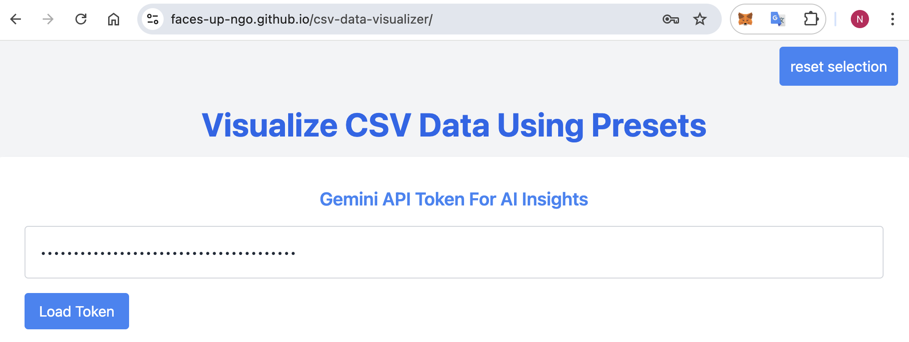
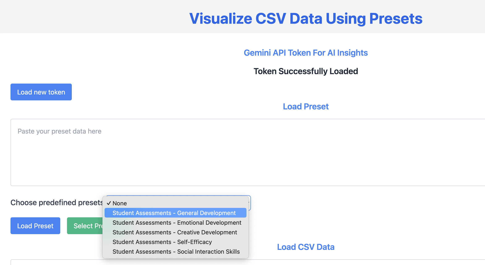

# What is data-visualizer

A tool to easily visualize Student Progress during the [FacesUp MentorMe](https://facesup.org/mentor-me/) project. 

# Instructions
## One time preparation: API token
* Create a [Google account](https://myaccount.google.com/) and/ or log in
* Follow [Google's instructions](https://ai.google.dev/gemini-api/) to get an API key from the Google AI studio. After successful generation a popup will occur with the API key. The API key is a long sequence of characters and numbers. Copy and save the API key.
* Start the [data visualizer tool](https://faces-up-ngo.github.io/csv-data-visualizer/) and enter your API key in the corresponding field, then push the "Load Token" button.
  
* In the address bar of the browser, an updated URL will appear. We recommend bookmarking this URL as your personalized entry page for the data visualizer tool.

   `https://faces-up-ngo.github.io/csv-data-visualizer/?gemini-api-key=<you_api_key>`.

## How to view a student's progress
### Data preparation
In Airtable: Export the student intake form into a CSV file

### Data visualizer tool
* Make sure you are connected to the internet
* Start the [data visualizer tool](https://faces-up-ngo.github.io/csv-data-visualizer/), ideally use your bookmarked link with the API key. Enter the API key if not done previously.
* Choose your type of analysis by selecting a so-called "preset" from the dropdown list and press `load preset`.
  
* Upload the CSV data exported from Airatable by pressing  `load data file`.
* Choose a student and select `Visualize`
* Generate the AI summaries by pressing the `Generate Insights` button below each chart
* Export the student's report to PDF for offline use or printing

## How to create your own data analysis ("preset")

1. Go to [Compose new presets](https://faces-up-ngo.github.io/csv-data-visualizer/compose.html)
2. Press "Upload Data" to select a CSV data file to be uploaded to the tool
3. Keep adding charts to your new preset until you are satisfied
   * Select a chart type (Line/Bar/Pie Chart)
   * Select a column from the data set to be visualized on the X axis
   * Select a column from the data set to be visualized on the Y axis
   * Press "Generate Chart" to see a preview the chart
4. Press "Export preset" to save the JSON file for your new preset (work in progress - not yet implemented)
5. Upload the new preset to the [preset folder](https://github.com/faces-up-ngo/csv-data-visualizer/tree/main/presets) in GitHub

# Contributions

This project was created for FacesUp through the [MovingWorlds](https://movingworlds.org/) program in autumn 2024. 
Many thanks to the great insights we collected together as a project team while working on this tool:
* [Ssekitto Kalule (CEO FacesUp)](https://www.linkedin.com/in/ssekitto-kalule-emmanuel-7442a389/)
* [Aleksandr Aytov (SAP)](https://www.linkedin.com/in/aleksandar-aytov/)
* [Ilie Ciotir (SAP)](https://www.linkedin.com/in/ilieciotir/)
* [Michael Graf (SAP)](https://www.linkedin.com/in/michadelic/)
* [Nadine Gärtner (SAP)](https://www.linkedin.com/in/nadinegaertner/)

Open tasks are managed in the [GitHub project](https://github.com/orgs/faces-up-ngo/projects/1).
Feel free to take a look for potential contributions and further tasks for extending to the tool.

# License

This project is licensed under the Apache Software License, version 2.0 except as noted otherwise in the [LICENSE](LICENSE.txt) file.
